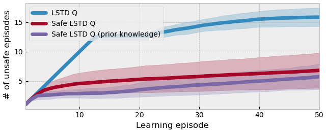

# Learning safety in model-based Reinforcement Learning using MPC and Gaussian Processes

[](https://github.com/FilippoAiraldi/learning-safely/blob/release/LICENSE)

[](https://github.com/psf/black)
[](https://codeclimate.com/github/FilippoAiraldi/learning-safety-in-mpc-based-rl/maintainability)



This repository contains the source code used to produce the results obtained in [our paper](https://arxiv.org/abs/2211.01860/) submitted to the 2023 IFAC WC.

In this work, we propose a straightforward yet effective algorithm for enabling safety in the context of Safe Reinforcement Learning (RL) using Model Predictive Control (MPC) as function approximation. The unknown constraints encoding safety are learnt from observed MPC trajectories via Gaussian Process (GP) regression, and are then enforced onto the RL agent to guarantee that the MPC controller is safe with high probability.

If you find the paper or this repository helpful in your publications, please consider citing it.

```latex
article{airaldi2022learning,
  author = {Airaldi, Filippo and De Schutter, Bart and Dabiri, Azita},
  title = {Learning safety in model-based Reinforcement Learning using MPC and Gaussian Processes},
  publisher = {arXiv},
  journal={arXiv preprint arXiv:2211.01860},
  year = {2022},
  doi = {10.48550/ARXIV.2211.01860},
  url = {https://arxiv.org/abs/2211.01860}
}
```

---

## Installation

The code was created with `Python 3.9.5`. To access it, clone the repository

```bash
git clone https://github.com/FilippoAiraldi/learning-safety-in-mpc-based-rl.git
cd learning-safely
```

and then install the required packages by, e.g., running

```bash
pip install -r requirements.txt
```

### Structure

The repository code is structured in the following way

- `agents` contains the RL algorithms used within the paper
  - the Perfect-Knowledge agent, a non-learning agent with exact information on the quadrotor drone dynamics
  - the LSTD Q-learning agent, in both its **safe** and **unsafe** variants, i.e., with and without our proposed algorithm, respectively.
- `envs` contains the quadrotor environment (in [OpenAI's `gym`](https://www.gymlibrary.dev/) style) used in the numerical experiment
- `mpc` contains the implementation (based [CasADi](https://web.casadi.org/)) of the MPC optimization scheme
- `resouces` contains media and other miscellaneous resources
- `sim` contains [pickle](https://docs.python.org/3/library/pickle.html)-serialized simulation results of the different agents
- `util` contains utility classes and functions for, e.g., plotting, I/O, exceptions, etc.
- `train.py` launches simulations for the different agents
- `visualization.py` visualizes the simulation results

---

## Training

Training simulations can easily be launched via command. The default arguments are already set to yield the results found in the paper. To reproduce the simulation results run the following command calling one of the 3 available

```bash
python train.py (--pk | --lstdq | --safe_lstqd)
```

Note that only one can be simulated at a time. Results will be saved under the filename `${runname}.pkl`.

---

## Visualization

To visualize simulation results, simply run

```bash
python visualization.py ${runname1}.pkl ... ${runnameN}.pkl
```

You can additionally pass `--papermode`, which will cause the paper figures to be created (in this case, the simulation results filepaths are hardcoded).

---

## License

The repository is provided under the GNU General Public License. See the LICENSE file included with this repository.

---

## Author

[Filippo Airaldi](https://www.tudelft.nl/staff/f.airaldi/), PhD Candidate [f.airaldi@tudelft.nl | filippoairaldi@gmail.com]

> [Delft Center for Systems and Control](https://www.tudelft.nl/en/3me/about/departments/delft-center-for-systems-and-control/) in [Delft University of Technology](https://www.tudelft.nl/en/)

> This research is part of a project that has received funding from the European Research Council (ERC) under the European Union’s Horizon 2020 research and innovation programme ([Grant agreement No. 101018826 - CLariNet](https://cordis.europa.eu/project/id/101018826)).

Copyright (c) 2023 Filippo Airaldi.

Copyright notice: Technische Universiteit Delft hereby disclaims all copyright interest in the program “learning-safety-in-mpc-based-rl” (Learning safety in model-based Reinforcement Learning using MPC and Gaussian Processes) written by the Author(s). Prof. Dr. Ir. Fred van Keulen, Dean of 3mE.